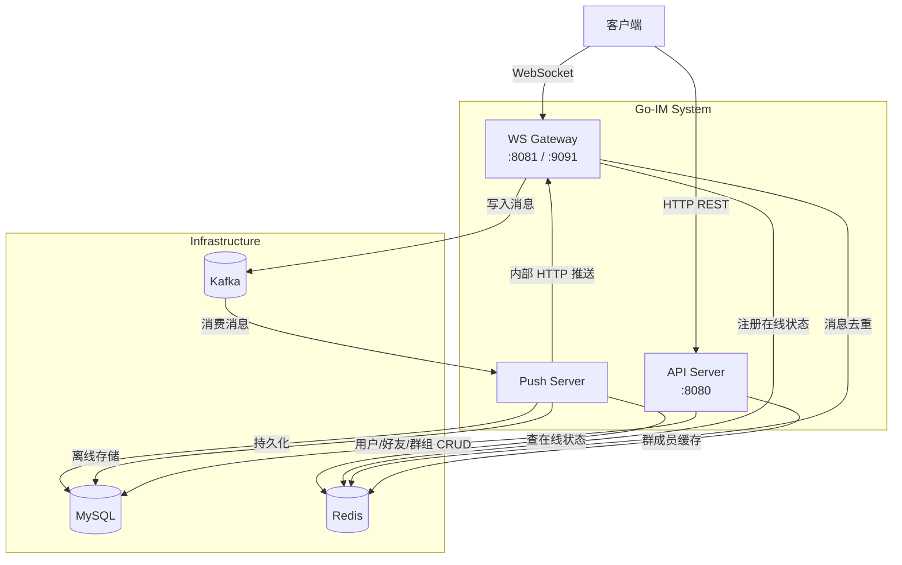
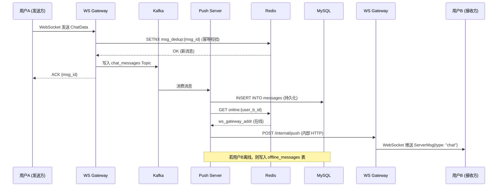

# go-im - 高性能即时通讯系统

基于微服务架构思想设计的 Go 语言即时通讯（IM）系统后端。支持单聊、群聊，基于 WebSocket 实现消息实时推送，使用 Kafka 做消息削峰解耦，Redis 做在线状态管理和消息防重，MySQL 做持久化存储。

## 架构图



## 核心特性

- **三服务拆分**：API Server（HTTP 接口）、WS Gateway（长连接维持）、Push Server（异步消费推送），各自独立部署
- **消息防重（幂等）**：客户端生成 msg_id，WS 网关通过 Redis SETNX 去重，避免重复投递
- **离线消息拉取**：用户离线时消息写入 offline_messages 表，上线后通过 API 拉取
- **Kafka 削峰解耦**：WS 网关收到消息后写入 Kafka，Push 服务异步消费，避免网关阻塞
- **在线状态管理**：Redis 存储 `online:{user_id} → ws_addr`，心跳刷新 TTL，支持精准路由
- **群聊扇出推送**：Push 服务查询群成员列表（Redis 缓存优先），逐成员在线检查并推送/离线存储
- **JWT 认证**：API 和 WS 连接均使用 JWT Token 鉴权
- **Snowflake ID**：消息 ID 使用 Snowflake 算法生成，天然有序
- **结构化日志**：Zap + Lumberjack，关键业务节点带 Context 字段输出
- **Docker Compose 一键部署**：MySQL、Redis、Kafka 及三个 Go 服务全量编排

## 技术栈

| 组件 | 技术选型 |
|------|---------|
| 语言 | Go 1.22+ |
| HTTP 框架 | Gin |
| WebSocket | gorilla/websocket |
| ORM | GORM + MySQL 8.0 |
| 缓存 | Redis 7 (go-redis) |
| 消息队列 | Kafka (kafka-go) |
| 认证 | JWT v5 |
| 配置 | Viper |
| 日志 | Zap + Lumberjack |
| ID 生成 | Snowflake |
| 容器化 | Docker + Docker Compose |

## 项目结构

```text
go-im/
├── cmd/
│   ├── api/main.go              # HTTP API 服务入口
│   ├── ws/main.go               # WebSocket 网关入口
│   └── push/main.go             # 异步推送服务入口
├── internal/
│   ├── config/                  # 配置加载
│   ├── model/                   # GORM 数据模型
│   ├── handler/                 # HTTP Handler（Gin）
│   ├── service/                 # 业务逻辑层
│   ├── repository/              # 数据访问层（MySQL + Redis）
│   ├── ws/                      # WebSocket 网关核心逻辑
│   ├── push/                    # 推送服务逻辑
│   ├── middleware/              # Gin 中间件
│   └── pkg/                     # 公共组件（JWT、响应、错误码、雪花ID、日志）
├── config/go-im.yaml            # 本地开发配置
├── deploy/
│   ├── docker-compose.yaml      # 容器编排
│   ├── Dockerfile               # 多阶段构建
│   ├── docker-config.yaml       # 容器内配置
│   └── mysql/init.sql           # 数据库初始化
├── Makefile
└── README.md
```

## 快速开始

### 方式一：Docker Compose 一键启动

```bash
# 全量启动（MySQL + Redis + Kafka + 三个 Go 服务）
make docker-up

# 查看日志
cd deploy && docker-compose logs -f

# 停止
make docker-down
```

### 方式二：本地开发

```bash
# 1. 启动中间件（MySQL + Redis + Kafka）
make env-up

# 2. 在不同终端分别启动三个服务
make run-api    # 终端 1：API 服务 → :8080
make run-ws     # 终端 2：WS 网关 → :8081 (WS) + :9091 (内部 RPC)
make run-push   # 终端 3：Push 服务

# 3. 停止中间件
make env-down
```

### 构建

```bash
# 编译三个服务到 bin/ 目录
make build

# 运行测试
make test
```

## API 接口

### 用户模块
| 方法 | 路径 | 说明 |
|------|------|------|
| POST | `/api/v1/user/register` | 用户注册 |
| POST | `/api/v1/user/login` | 用户登录 |
| GET | `/api/v1/user/info` | 获取用户信息 |

### 好友模块
| 方法 | 路径 | 说明 |
|------|------|------|
| POST | `/api/v1/friend/add` | 发送好友申请 |
| POST | `/api/v1/friend/accept` | 同意好友申请 |
| GET | `/api/v1/friend/list` | 获取好友列表 |

### 群组模块
| 方法 | 路径 | 说明 |
|------|------|------|
| POST | `/api/v1/group/create` | 创建群组 |
| POST | `/api/v1/group/join` | 加入群组 |
| GET | `/api/v1/group/list` | 我的群组列表 |
| GET | `/api/v1/group/members` | 获取群成员 |

### 消息模块
| 方法 | 路径 | 说明 |
|------|------|------|
| GET | `/api/v1/message/offline` | 拉取离线消息 |
| GET | `/api/v1/message/history` | 历史消息（游标分页） |

### WebSocket
- 连接地址：`ws://host:8081/ws?token=<JWT_TOKEN>`
- 上行消息格式：`{"type": "chat", "data": {"msg_id": "...", "to_id": 123, "chat_type": 1, "content_type": 1, "content": "hello"}}`
- 下行消息格式：`{"type": "ack", "data": {"msg_id": "..."}}` / `{"type": "chat", "data": {...}}`

## 单聊消息时序图



## 统一响应格式

```json
{
    "code": 0,
    "msg": "success",
    "data": {}
}
```

- `code = 0` 表示成功
- `code != 0` 对应 `internal/pkg/errcode` 中定义的业务错误码

## License

MIT
